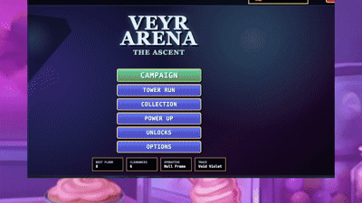

# Veyr Arena

Top down tactical tower prototype.

<p align="center">
  
</p>

[Watch preview with music and sound](assets/media/veyr-arena-preview-with-audio.mp4)

## Run

```bash
python3 -m http.server 5187
```

Open:

```text
http://localhost:5187
```

Windows:

```powershell
py -m http.server 5187
```

## Controls

- WASD: move
- Shift: sneak
- Mouse: aim
- Left click: shoot
- R: reload
- 1 to 9: switch weapons found in this run
- E: throw smoke
- Q: Pulse
- H: debug overlay
- Enter: start or restart tower
- Esc: main menu

## Current systems

- Fullscreen menu pass inspired by Vampire Survivors layout language
- Top down arenas with line of sight, smoke, cover, and route choices
- Contracts after each floor: Clean Duel, Weapon Cache, Rival Contract
- Boss/rival floors
- Final kill slow motion replay
- Hit stop, muzzle flash, recoil, tracers, shell casings, impacts, blood decals
- Health bar under the player and ammo counter in the bottom right
- Post floor celebration and reward choice
- Persistent shards, PowerUps, Unlocks, and Collection
- Collection now uses operative suit sprites and trace tints instead of old geometric body shapes
- Weapons are rarer and mainly come from cache contracts
- Normal rewards now favor Pulse, movement, defense, and utility tools

## Assets

Assets are kept local in `/assets`.

Current external packs used from files provided by the user:

- Kenney Desert Shooter Pack
- Kenney Blaster Kit
- Kenney Retro Textures Fantasy
- Kenney UI Pack Adventure
- Kenney Starter Kit FPS
- Kenney Voiceover Pack: Fighter

License files are kept in:

```text
assets/licenses/
```

## Current weakness

The next hard problem is not adding more content. It is making every rival feel fair, dangerous, and distinct without increasing enemy count too much.


## v3.0 audio and cleanup pass

- Main menu visual palette moved away from the red/gold clone look into a darker Veyr contract terminal style.
- Top bar simplified: profile icon, runner name, shards, quit.
- Options now include volume sliders.
- Player footsteps use the current arena material.
- Shift movement uses quieter footsteps.
- Snow, forest, concrete, wood, gravel, and laminate step clips were added.
- Gunshots now use trimmed user supplied gun audio layered with the existing generated punch.
- Snow and forest arena materials were added.


## Audio notes

Footsteps are intentionally readable. Running is louder and faster. Sneaking with Shift lowers the volume and spacing, while enemy footsteps are audible when they are close enough to matter. The mouse cursor is hidden during active play so the drawn crosshair is the only aim read.


## V3.2 tactics pass

- Input buffer on shooting so a click just before the weapon is ready still fires.
- Subtle aim assist for visible targets only.
- Smaller player projectile hitbox for better near misses.
- Near miss feedback.
- Dynamic top down lighting with muzzle flash light.
- Stronger boss pressure overlay.
- More boss personality, taunts, side cuts, smoke resets, and duel behavior.
- Suppression behavior from SMG, LMG, shotgun, and breacher fire.
- Revolver bank shots from walls.
- DMR pierce follow through.
- More blood, hit spray, and stronger death decals.
- Main menu button spacing and sizing cleanup.


## v3.3 cleanup notes

- Boss floors now open with a short rival intro card before the countdown.
- The main menu uses a cleaner single-column button layout.
- Collection cards no longer show filler description text.
- The player-following darkness ring was removed. Lighting is now map-based vignette and wall shadow only.


## v3.4 fix notes

- Main menu buttons are centered in one uniform stack and no longer cover the title.
- Boss intro cards were rebuilt so sprites stay contained and the dialogue box is readable.
- The player-following darkness effect was removed. Lighting now comes from map tint, object shadows, smoke, muzzle flashes, and boss pressure.
- Low health bots can route to med pickups. Bosses and skilled enemies can shoot through smoke at last known positions if they have a reason.


## v3.5 Flicker stealth pass

- Added one stealth boss only: Flicker.
- Normal enemies are not invisible. They still use line of sight, sound, cover, smoke, and flanks.
- Flicker leaves faint movement traces, can fake traces at low health, and is revealed by gunfire, taking damage, attacking, or Pulse.
- Running enemies near the player can leave subtle ground traces, but footsteps remain audio-first.
- Gunshots and attacks reveal the stealth boss long enough to punish.


## v3.6 notes

- Stages now expand into larger scrolling arenas.
- Footprints only draw when the viewer has line of sight to the footprint itself.
- Player footsteps leave fading tracks that bots can inspect if they see them.
- Flicker remains the stealth boss, but normal enemies do not become invisible.
- Added additional boss kits: Venom uses poison puddles, Graves summons weak flankers.


## v3.7 story pass

- Added Story mode chapter select.
- Added chapter freeze frame scenes before contracts.
- Added recovered notes / archive entries.
- Added more operative suits, trace tints, PowerUp ranks, and unlock goals.
- Story contracts reuse the tactical tower loop but theme stage order and scene text around the selected chapter.
- Generated story background images are included under `assets/story/`.


## v3.8 campaign repair

- Story mode was reframed as a campaign about climbing Veyr to reach Mira, who is held above the tower.
- Campaign scenes now appear only on scripted floors instead of repeating filler lines every floor.
- Boss dialogue was rewritten as villain fight lines instead of behavior-analysis callouts.
- Main menu buttons were rebuilt as one uniform centered stack.
- Collection, Power Up, Unlocks, and Options menu functions were restored after the broken story pass.


## v4.2 campaign audio and progress pass

- Campaign mode now shows a small floor tracker during fights.
- Boss floors use the uploaded boss fight music.
- Story chapter selection plays the uploaded intro sting.
- Failed runs play the uploaded defeat outro.
- Reward picks use the uploaded upgrade sound.
